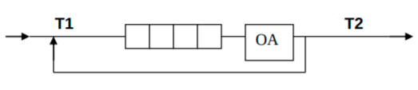

# Отчёт по Лабораторной работе №5 "Обработка очередей"

Вариант: 7

Студент: **Недолужко Денис**

Группа: **ИУ7-33Б**

Год: 2020

## Описание условия задачи

Отработка навыков работы с типом данных «очередь»,
представленным в виде одномерного массива и односвязного линейного
списка. Сравнительный анализ реализации алгоритмов включения и
исключения элементов из очереди при использовании двух указанных
структур данных. Оценка эффективности программы (при различной
реализации) по времени и по используемому объёму памяти.

## Описание ТЗ

### Описание задачи

Система массового обслуживания состоит из обслуживающего аппарата
(ОА) и очереди заявок.



Заявки поступают в "хвост" очереди по случайному закону с интервалом
времени Т1, равномерно распределённым от 0 до 6 единиц времени (е.в.). В
ОА они поступают из "головы" очереди по одной и обслуживаются также
равновероятно за время Т2 от 0 до 1 е.в., Каждая заявка после ОА вновь
поступает в "хвост" очереди, совершая всего 5 циклов обслуживания, после
чего покидает систему. (Все времена – вещественного типа) В начале
процесса в системе заявок нет.

Смоделировать процесс обслуживания до ухода из системы первых 1000
заявок, выдавая после обслуживания каждых 100 заявок информацию о
текущей и средней длине очереди, а в конце процесса - общее время
моделирования и количестве вошедших в систему и вышедших из неё заявок,
количестве срабатываний ОА, время простоя аппарата. По требованию
пользователя выдать на экран адресов элементов очереди при удалении и
добавлении элементов. Проследить, возникает ли при этом фрагментация
памяти.

### Входные данные

1. Использование значений по умолчанию
2. Ручной ввод минимальных и максимальных интервалов поступления новых заявок,
времени обработки заявки, число циклических обработок одной заявки,
необходимое число обработанных заявок для выхода

### Выходные данные

Количество вошедших в систему заявок, количество обработанных заявок,
количество покинувших систему заявок, среднее время проведения заявки в очереди,
длина списка заявок, средняя длина списка заявок, общее время моделирования во
временных единицах и астрономическое для очереди реализованной массивом и
списком. А так же ожидаемые время выполнения моделирования.

### Способ обращения к программе

Запускается в терминале командой `./app.exe` в папке с программой.

### Описание возможных аварийных ситуаций

Некорректный ввод пользователя. Сообщение `Некорректный ввод`.
Невозможность выделения памяти под переменные `Невозможно выделить память под
переменную`
Переполнение массива `Вектор переполнен`

## Описание внутренний структур данных

```c
typedef struct
{
    void **elements;
    size_t used_length;
    size_t length;

    size_t el_size;
} ptr_vector_t;
```

Структура для хранения адресов элементов списка для отслеживания фрагментации

* elements - массив указателей
* used\_length - количество занятых ячеек в массиве
* length - длина массива
* el\_size - размер одного элемента массива

---

```c
struct request
{
    int value;
    int processing_count;
    double creating_time;
    double first_service_time;
};
```

Структура заявки

* value - номер заявки
* processing\_count - число прохождений через ОА
* creating\_time - время создания заяви
* first\_service\_time - время первого прохождения заявки через ОА

---

```c
typedef struct request_node request_node_t;

struct request_node
{
    request_t data;
    request_node_t *next;
};

typedef struct list list_t;

struct list
{
    request_node_t *head;
    request_node_t *tail;
};
```

Структуры для реализации очереди в виде списка

* data - заявка
* next - указатель за следующий элемент списка
* head - указатель на голову списка
* tail - указатель на хвост списка

---

```c
struct queue_vector_t
{
    request_t *right_border;
    request_t *left_border;

    request_t *pin;
    request_t *pout;

    size_t length;
    size_t used_len;
    size_t el_size;

    bool is_full;
};
```

Структура для реализации очереди в виде массива

* right\_border - правая граница массива
* left\_border - левая граница массива
* pin - указатель на ячейку для вставки заявки
* pout - указатель на ячейку для извлечения заявки
* length - длина массива
* used\_len - число занятых ячеек
* el\_size - размер элемента массива
* is\_full - индикатор занятости массива

---

```c
struct modeling_list
{
    list_t request_list;
    request_node_t *processing_request;

    int created_request_count;
    int processed_request_count;
    int ended_request_count;

    double next_arrival_time;
    double next_service_end_time;

    double avg_list_len;
    int avg_list_len_count;

    double avg_queue_time;
    int avg_queue_time_count;

    double end_modeling_time;
};

struct modeling_vector
{
    queue_vector_t *request_vector;
    request_t processing_request;
    bool is_no_processing_request;

    int created_request_count;
    int processed_request_count;
    int ended_request_count;

    double next_arrival_time;
    double next_service_end_time;

    double avg_list_len;
    int avg_list_len_count;

    double avg_queue_time;
    int avg_queue_time_count;

    double end_modeling_time;
};
```

Структуры для хранения данных моделирования

* request\_list, request\_vector - структуры со списком и
массивом соответственно
* processing\_request - место для хранения заявки
обрабатываемой в ОА
* is\_no\_processing\_request - индикатор пустоты ОА для
реализации массивом
* created\_request\_count - число созданных заявок
* processed\_request\_count - число заявок прошедших через ОА
* ended\_request\_count - число обработанных заявок
* next\_arrival\_time - время создания следующей заявки
* next\_service\_time - время окончания обработки заявки в ОА
* avg\_list\_len - средняя длина списка
* avg\_list\_len\_count - количество проведённых измерений
* avg\_queue\_time - среднее время нахождения заявки в очереди
* avg\_queue\_time\_count - количество проведённых измерений
* end\_modeling\_time - время конца моделирования

---

```c
struct service_unit
{
    double min_arrival_time;
    double max_arrival_time;

    double min_service_time;
    double max_service_time;

    int one_request_cycle_count;
    int ended_request_count;
};
```

Структура содержащая данные моделирования

* min\_arrival\_time, max\_arrival\_time - диапазон времени прибытия новой
заявки
* min\_service\_time, max\_service\_time - диапазон времени обработки заявки
* one\_request\_cycle\_count - количество прогонов одной заявки в ОА для выхода
* ended\_request\_count - необходимое число покинувших ОА заявок

## Описание функций

Добавление и извлечения заявки из очереди на основе списка

```c
void list_append(list_t *list, request_node_t *item);
request_node_t *list_pop(list_t *list);
```

Добавление и извлечения заявки из очереди на основе массива

```c
int queue_vector_append(queue_vector_t *vector, request_t *data);
int queue_vector_pop(queue_vector_t *vector, request_t *data);
```

Функции для создания и очистки очередей на основе списка

```c
request_node_t *request_node_create(request_t request);
void request_node_free(request_node_t **item);
list_t list_init();
void list_free(list_t *list);
```

Функции для создания и очистки очередей на основе массива

```c
queue_vector_t *queue_vector_allocate(const size_t length);
void queue_vector_free(queue_vector_t *vector);
int queue_vector_append(queue_vector_t *vector, request_t *data);
```

Функции для моделирования обслуживающего автомата

```c
int list_service_modeling(modeling_list_t *model, service_unit_t service);
int vector_service_modeling(modeling_vector_t *model, service_unit_t service);
```

## Результаты измерений

### Фрагментация

Фрагментация при реализации списком не наблюдается. Новые элементы встают на
места прежде удалённых.

### Время и память

Время измеряется в тактах, размер - в байках

#### Список

|Количество элементов|Добавление|Удаление|Размер|
|--------------------|----------|--------|------|
|                1000|      168k|     74k| 32000|
|                2000|      200k|     99k| 64000|
|                5000|      694k|    518k|160000|
|               10000|     1769k|    490k|320000|
|               20000|     2031k|   1077k|640000|

#### Вектор

|Количество элементов|Добавление|Удаление|Размер|
|--------------------|----------|--------|------|
|                1000|       37k|     30k| 24000|
|                2000|       69k|     63k| 48000|
|                5000|      171k|    145k|120000|
|               10000|      374k|    293k|240000|
|               20000|      967k|    894k|480000|

Получаем:

* добавление элементов в список происходит в 2-5 раз медленнее,
  чем в добавление массив
* удаление элементов из списка происходит в 1.2 - 2.5 раза медленнее,
  чем удаление элементов из массива
* список занимает на 33% больше памяти, чем полностью заполненный массив

## Вывод

Если в приоритете находятся экономия времени или памяти и известна хотя бы
приблизительно максимальный размер очереди, то выгоднее использовать массив,
так как в случае реализации списком требуется дополнительное время на выделение
и освобождение памяти каждого узла, в то время как память под массив выделяется
и очищается однократно. Однако, если приблизительный максимальных размер
очереди неизвестен, то, конечно, выгоднее использовать список.

Фрагментации при реализации очереди списком нет.

## Вопросы

1. Что такое очередь? \
Очередь – это последовательный список переменной длины, включение
элементов в который идёт с одной стороны (с «хвоста»), а исключение – с другой
стороны (с «головы»). Принцип работы очереди: первым пришёл – первым вышел, то
есть First In – First Out (FIFO)
2. Каким образом, и какой объем памяти выделяется под хранение очереди при
различной её реализации? \
При реализации очереди при помощи массива память на неё выделяется один раз
в начале одним блоком размером
`<Максимальное количество элементов в очереди> * sizeof(request)`. \
При реализации очереди списком память под каждый элемент выделяется
непосредственно перед его созданием. И занимаемый объем памяти:
`<Kоличество элементов в очереди> * sizeof(request)`.
3. Каким образом освобождается память при удалении элемента из очереди при
её различной реализации? \
При реализации списком память элемента удаляется сразу при удалении его из
очереди. При реализации вектором - память очищается единожды в конце программы.
4. Что происходит с элементами очереди при её просмотре? \
Очередь очищается
5. Каким образом эффективнее реализовывать очередь. От чего это зависит? \
Зависит от приоритета. Если в приоритете скорость или известна максимальная
длина очереди, то эффективнее использовать массив. В противном случае - список.
6. В каком случае лучше реализовать очередь посредством указателей, а в
каком – массивом? \
Массив - если известна максимальная длина очереди или в приоритет скорость
работы в противном случае - список.
7. Каковы достоинства и недостатки различных реализаций очереди в
зависимости от выполняемых над ней операций? \
При реализации очереди массивом может произойти переполнение, а при реализации
очереди списком затрачивается большее количество времени на добавлении нового
элемента, также для хранения указателей требуется дополнительная память.
8. Что такое фрагментация памяти? \
Наличие в ОЗУ большого числа коротких не смежных блоков, не позволяющее
удовлетворить запрос на выделение блока большего размера.
9. На что необходимо обратить внимание при тестировании программы? \
На переполнение очереди в случае реализации массивом, и на фрагментацию в случае
реализации списком.
10. Каким образом физически выделяется и освобождается память при
динамических запросах? \
При запросе памяти, ОС находит подходящий блок памяти в куче и помечает его как
занятый. При освобождении ОС снимает эту метку.
